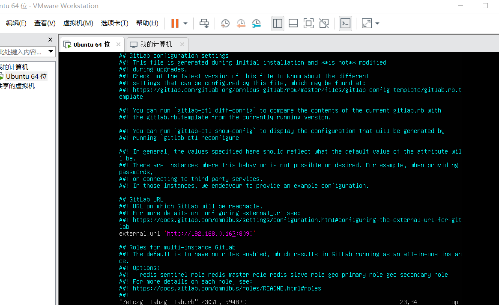

windows下虚拟机啊搭建gitlab

<!-- more -->

# windows下虚拟机啊搭建gitlab

## 环境

1. vmware
2. vmware-ubuntu18

## 步骤

### 安装gitlab

1. 安装所需依赖 `sudo apt-get install curl openssh-server ca-certificates `

2. 邮件通知服务 `sudo apt-get install postfix` 根据需求选择性安装

3. 添加package `curl https://packages.gitlab.com/install/repositories/gitlab/gitlab-ce/script.rpm.sh >> gitlab.sh` ,然后执行`sudo bash gitlab.sh`

4. (可选)更换gitlab国内源

	1. 首先信任 GitLab 的 GPG 公钥,`curl https://packages.gitlab.com/gpg.key >>gitlab.key` ,然后添加 `sudo apt-key add gitlab.key`
	
	2. 修改`/etc/apt/sources.list.d/gitlab-ce.list`,直接在原有文件上修改.修改链接参考[清华源](https://mirror.tuna.tsinghua.edu.cn/help/gitlab-ce/)
	
		```shell
      deb https://mirrors.tuna.tsinghua.edu.cn/gitlab-ce/ubuntu xenial main

      #后面的xenial main不用动(根据不同的版本会显示不同的代号),直接修改中间的一段链接就可以
		```


5. `sudo apt-get install gitlab-ce`
6. 安装成功之后,修改配置文件,`sudo vim /etc/gitlab/gitlab.rb` ,`external_url`那一行
	 

### 虚拟机相关设置

1. 使用桥接模式,选择正确的设备,查看ip,`ifconig`
2. 输入修改的域名和端口即可,默认端口好像是8080,可以直接在域名后面添加端口即可

---

